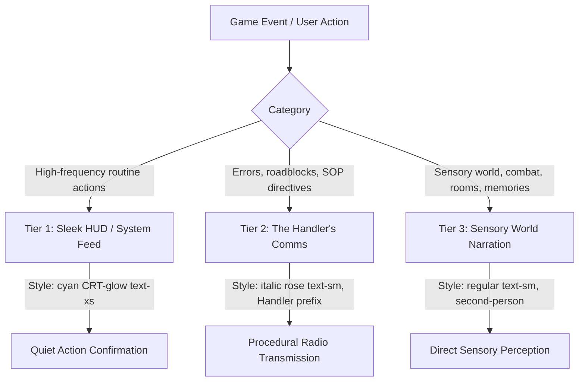

# Layla — Narration & Voice Guide

This document is the dedicated, authoritative guide for writing and formatting all prose, player feedback, and system communications in the **Layla** content pack.

---

## 1. The 3-Tier Voice Hierarchy

Player interactions in Layla are communicated through three distinct tiers:

### Quick Reference Matrix

| Tier | Channel / Voice | Visual Style | Purpose | Example |
|---|---|---|---|---|
| **Tier 1: HUD / System Feed** | `voice: "system"` (`NarrativeLineKind::System`) | Cyan CRT-glow, `text-xs`, monospace/clean | Routine, high-frequency micro-actions (taking, dropping, equipping, party orders). Low friction. | `Picked up chisel-axe.` `Alex assigned to guard.` |
| **Tier 2: Handler Comms** | `voice: "handler"` (`NarrativeLineKind::Channel`) | Italic rose, `Handler:` prefix | Roadblocks, system errors, SOP directives, objective reminders, confusion. | `Handler: The playbook says you need the worn scroll for this.` |
| **Tier 3: World Narration** | `NarrativeLineKind::Narration` | Standard body text, `text-sm` | Immediate physical reality: room inspection, combat strikes, creature behavior, memories. | `You wrap your hand around the chisel-axe. It bites into stone and meat alike.` |

---

## 2. Tier 1: Sleek HUD / System Feed (Routine Actions)

### Philosophy: Zero Narrative Fatigue
When players perform routine inventory and combat management ten or twenty times in a crawl, they do not need a conversational interruption. Repetitive micro-actions must be **instant, quiet, and unobtrusive**.

### Formatting Rules
1. **Never use raw ALL-CAPS terminal shouting.** Retire legacy mainframe strings (`INVENTORY UPDATED: ...`, `OBJECT NOT EQUIPPED: ...`).
2. **Use concise, sentence-case action confirmations.**
3. **Keep confirmations to a single line** with direct verb-object syntax.

### Authoring Guide:
| Event | Legacy Syntax (Retired) | Approved Tier 1 Syntax |
|---|---|---|
| Take Item | `INVENTORY UPDATED: {label} acquired.` | `Picked up {label}.` |
| Place / Drop Item | `LOCAL OBJECT REGISTERED: {label}.` | `Dropped {label}.` |
| Equip Gear | `EQUIPPED: {item}. {bonuses}.` | `Equipped {item}. {bonuses}` |
| Unequip Gear | `UNEQUIPPED: {item}.` | `Unequipped {item}.` |
| Item Expended | `ITEM EXPENDED: {label}.` | `Used {label}.` |
| Assign Guard Order | `ORDER UPDATED: {actor} assigned to GUARD.` | `{actor} assigned to guard.` |
| Assign Assist Order | `ORDER UPDATED: {actor} assigned to ASSIST.` | `{actor} assigned to assist.` |

---

## 3. Tier 2: The Handler's Comms (Roadblocks & Systems)

### Who the Handler Is
System directives and roadblocks come from Layla's human handler—a young, anxious corporate employee monitoring the crawl from a remote console.
- **Bound by procedure:** He relies on corporate SOPs, route sheets, and playbooks because he is terrified of making a mistake.
- **Human, not robotic:** When instructions fail, he admits it ("That's on my side, Layla, not yours"). He gets nervous, corrects himself, and occasionally treats Layla like a person before remembering he isn't supposed to.
- **Operational brevity:** His lines must remain crisp operational feedback. Do not turn every message into a comedy routine or a long monologue.

### When the Handler Speaks
The handler speaks **only** when there is a reason to intervene:
- Blocked actions or unmet prerequisites.
- Navigation dead ends or map discrepancy errors.
- Unrecognized commands or console glitches.
- Critical mission objectives or SOP directives.

### Authoring Guide:
| Scenario | Approved Handler Line |
|---|---|
| Immovable Feature | *"Leave the {label} where it is — the field notes say it's anchored to the floor. I'd rather not find out if they're wrong."* |
| No Exit | *"No, sorry. The route sheet doesn't show a path to {target} from there."* |
| Unknown Command | *"I don't have `{raw_input}` in the approved playbook. Try {available_commands}. Sorry—I know that's not very helpful."* |
| Missing Prerequisite | *"The playbook says you need the {label} before you can do that."* |
| Target Required | *"I need a target for that. Who are you aiming at? ({actors})"* |
| No Target in Room | *"Target what? There's no one in the room right now."* |
| Duplicate Sigil | *"There's already a trace mark drawn in this spot."* |
| Unequip Required | *"You're wearing that right now. Unequip the {label} first."* |
| Invalid Party Member | *"I don't show {actor} in your room right now. Check who's with you."* |
| Ambiguous Name | *"I have more than one match in the registry for that. Be a bit more specific?"* |
| Non-Equippable Item | *"The equipment chart says you can't equip {item}."* |

---

## 4. Tier 3: Sensory World Narration (Layla's Experience)

### Core Rules
1. **Strictly Second-Person (`You...`)**:
   Always narrate from Layla's immediate sensory vantage point. Never refer to Layla in the third person during active crawl narration (e.g. avoid *"Layla strikes..."* or *"{actor_name} wraps a hand around the axe"*).
2. **Simple, Concrete Prose**:
   Write at the level of a clear young-adult novel. Short sentences, concrete verbs, sensory precision. Avoid purple prose and Latinate abstractions.
3. **Text as Eyes, Ears, and Hands**:
   Cinder has no 3D graphics. Your prose provides the player's spatial reality:
   - **Sight**: Lighting quality (orange embers, dim phosphorescence, chalk dust, long shadows).
   - **Sound**: Rhythmic scraping, dripping water, distant drumming (*tock... tock*), chittering teeth.
   - **Smell**: Old smoke, wet musk, sour grease, sharp hot clay, burnt herbs.
   - **Touch**: Cold chipped stone, warm chalk, greasy hide, bone edges.
4. **Enemies Described in Material Terms**:
   Describe creatures by mass, mineral composition, posture, and hunger (granite, muddy grey-green, pebble eyes, dull bone). Never frame them as moral villains or evil monsters.

---

## 5. Layla's Character on the Page

### 1. The Pattern-Seeking Mind (Autistic / Systems Lens)
Layla reads the world as an architecture of rules:
- She counts steps, seams, and bone stacks.
- She notices right angles, geometric symmetries, and crossing tracks.
- She analyzes room structures like an experienced player inspecting an unfamiliar board.
- When she learns a new mark or rule, it feels like an old move returning to muscle memory.

### 2. Quiet Empathy for Charmed Followers
Layla is instinctively gentle with the golems and creatures she charms, without understanding why:
- She does not lecture the player or express sentimental pity.
- Her care shows purely through action: pausing to let heavy stone feet find their footing, matching their pace, slowing down by half a stride so they can stay close.
- Unconsciously, she recognizes that they, like her, are made things operating under an imposed external will.

---

## 6. Authoring Sanity Checklist

Before adding or editing content in `content/layla/`:

- [ ] **Voice Check:** Is routine feedback formatted as sleek sentence-case Tier 1 HUD?
- [ ] **Handler Check:** If it's a roadblock or error, does it sound like an anxious, procedural human handler referencing SOPs/field notes?
- [ ] **POV Check:** Is all world narration and equipment flavor strictly in the **second person** (`You...`)?
- [ ] **Sensory Check:** Does the room or action description include at least one concrete sound, smell, or tactile texture?
- [ ] **Tone Check:** Are enemies described in material/physical terms rather than moral terms?
- [ ] **Character Check:** Does Layla's observation notice geometry, counts, or physical rules?
