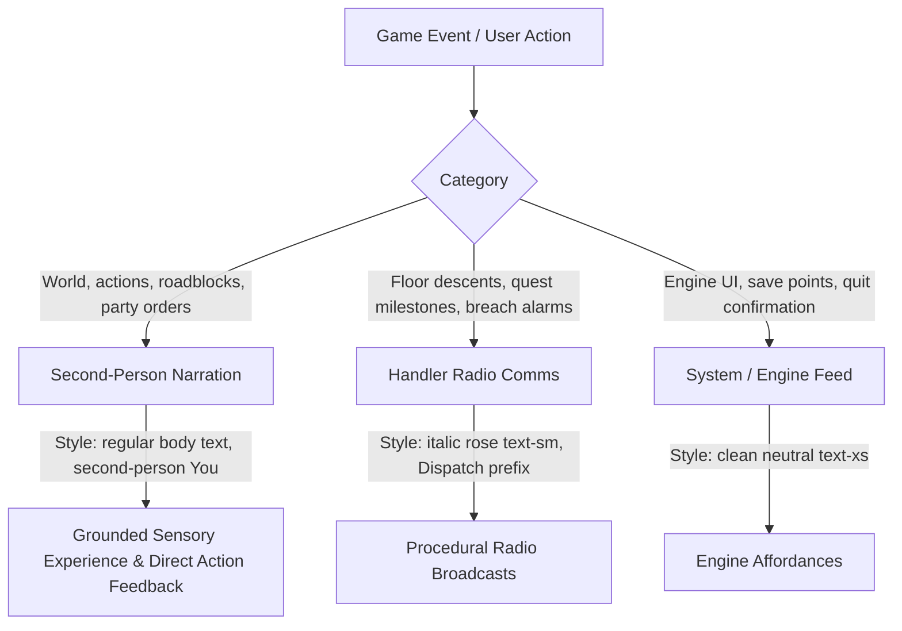

# Layla — Narration & Voice Guide

This document is the dedicated, authoritative guide for writing and formatting all prose, player feedback, and system communications in the **Layla** content pack.

---

## 1. The Voice Architecture

Player interactions in Layla are communicated through two primary storytelling channels plus neutral engine affordances:

```mermaid
flowchart TD
    Event[Game Event / User Action] --> VoiceSelect{Category}
    VoiceSelect -->|World, actions, roadblocks, party orders| Narration[Second-Person Narration]
    VoiceSelect -->|Floor descents, quest milestones, breach alarms| Handler[Handler Radio Comms]
    VoiceSelect -->|Engine UI, save points, quit confirmation| SystemUI[System / Engine Feed]

    Narration -->|Style: regular body text, second-person You| Out1[Grounded Sensory Experience & Direct Action Feedback]
    Handler -->|Style: italic rose text-sm, Dispatch prefix| Out2[Procedural Radio Broadcasts]
    SystemUI -->|Style: clean neutral text-xs| Out3[Engine Affordances]
```

### Quick Reference Matrix

| Channel / Voice | Visual Style | Purpose | Example |
|---|---|---|---|
| **Second-Person Narration** | Standard body text, `text-sm` (`NarrativeLineKind::Narration`) | Direct physical reality: sensory exploration, combat, item handling, party orders, and physical roadblocks. | `You wrap your hand around the chisel-axe.` `You assign Alex to guard your flank.` `You see no path north from here.` |
| **Handler Comms** | Italic rose, `Dispatch • Handler` prefix (`NarrativeLineKind::Channel`) | Radio dispatches: narrative milestones, floor transitions, mission objectives, and high-stakes tactical warnings. | `Dispatch • Handler: Cage count reads zero. Every one of them breathing, which was nowhere on my forecast.` |
| **System / Engine Feed** | Clean, muted typography (`NarrativeLineKind::System`) | Engine-level affordances and meta-interaction: bookmark save points, session resumes, confirmation prompts. | `Saved bookmark to slot 1.` |

---

## 2. Second-Person Gameplay & Action Feedback

### Philosophy: Grounded Immediacy
All routine physical actions (taking items, equipping gear, commanding companions) and physical impossibilities (blocked doors, anchored items, empty packs) are told directly from Layla's immediate perspective in the second person (`You...`).

We **never** break character with a pseudo-bureaucratic third voice citing corporate manuals, route sheets, or equipment charts for mundane physical failures. If Layla cannot go north, she simply does not see a path. If she tries to take an anchored pillar, stone does not yield.

### Formatting Rules
1. **Always use second-person phrasing (`You...` / `Your...`).**
2. **Avoid passive or robotic logs** (e.g. do not use `Picked up sword.` or `Alex assigned to guard.`; use `You pick up the sword.` and `You assign Alex to guard your flank.`).
3. **No faux-clerical roadblocks.** Retire references to "the playbook", "the route sheet", "the recognition guide", or "the equipment chart". The world itself resists or guides the player.

### Authoring Guide:
| Scenario | Former Bureaucratic Style (Retired) | Second-Person Narration (Approved) |
|---|---|---|
| Take Item | `Picked up {label}.` | `You pick up {label}.` |
| Anchored Item | `Leave the {label} where it is — the field notes say it's anchored...` | `The {label} is firmly anchored to the floor; you cannot pry it loose.` |
| Drop Item | `Placed {label} on the ground.` | `You place {label} on the ground.` |
| Empty Pack Drop | `Your pack is already empty—nothing to drop.` | `Your pack is already empty; you have nothing to drop.` |
| Equip Gear | `The equipment chart says you can't equip {item}.` | `You equip {item}. {bonuses}` / `You cannot equip {item}.` |
| Navigation Block | `No, sorry. The route sheet doesn't show a path to {target}...` | `You see no path {target} from here.` |
| Party Assignment | `Alex assigned to guard.` | `You assign {actor} to guard your flank.` |
| Party Member Absent | `I don't show {actor} in your room right now.` | `You don't see {actor} in the room with you.` |
| Ambiguous Name | `I have more than one match in the registry for that.` | `More than one target matches '{actor}'. Be more specific.` |
| Missing Prerequisite | `The playbook says you need the {label} before you can do that.` | `You need the {label} to do that.` |
| Unknown Command | `I don't have {raw_input} in the approved playbook.` | `You don't know how to '{raw_input}'. Try {available_commands}.` |

---

## 3. The Handler: Narrative Radio Comms

### Who the Handler Is
The Handler is Layla's remote console operator—a dry, sarcastic, patronizing surface observer monitoring the crawl through a radio link.
- **Remote observer:** He is not in the dungeon. He only sees telemetry, board state, and vital signs on his console.
- **Professional cynicism masking anxiety:** His sarcasm is armor. He cracks deadpan jokes about the dungeon's absurdity because he cannot reach in to save her and is genuinely invested in keeping her intact.
- **Narrative weight:** Because he no longer interrupts every routine movement error or equip click, his radio transmissions carry true narrative weight when the comms crackle to life.

### When the Handler Speaks
The Handler speaks **exclusively** on significant narrative moments:
- **Floor transitions:** Introducing new environments (e.g. descending to Floor 2's deep wood or Floor 5's citadel).
- **Major quest milestones:** Acknowledging the freeing of prisoners, finding Zayd, or clearing corrupted guardians.
- **Tactical emergencies:** Countdown warnings when siege forces breach civilian quarters (`civilian.breach_warning`).
- **Story friction:** Challenging Layla when her choices diverge from corporate expectations.

---

## 4. Sensory World Narration (Layla's Experience)

### Core Rules
1. **Strictly Second-Person (`You...`)**:
   Always narrate from Layla's immediate sensory vantage point. Never refer to Layla in the third person during active crawl narration (e.g. avoid *"Layla strikes..."* or *"{actor_name} wraps a hand around the axe"*).
2. **Simple, Concrete Prose**:
   Write at the level of a clear young-adult novel. Short sentences, concrete verbs, sensory precision. Avoid purple prose and Latinate abstractions.
3. **Text as Eyes, Ears, and Hands**:
   Cinder has no 3D graphics. Your prose provides the player's spatial reality:
   - **Sight**: Lighting quality (orange embers, dim phosphorescence, chalk dust, long shadows).
   - **Sound**: Rhythmic scraping, dripping water, distant drumming (*tock... tock*), chittering teeth.
   - **Smell**: Old smoke, wet musk, sour grease, sharp hot clay, burnt herbs.
   - **Touch**: Cold chipped stone, warm chalk, greasy hide, bone edges.
4. **Enemies Described in Material Terms**:
   Describe creatures by mass, mineral composition, posture, and hunger (granite, muddy grey-green, pebble eyes, dull bone). Never frame them as moral villains or evil monsters.

---

## 5. Layla's Character on the Page

### 1. The Pattern-Seeking Mind (Autistic / Systems Lens)
Layla reads the world as an architecture of rules:
- She counts steps, seams, and bone stacks.
- She notices right angles, geometric symmetries, and crossing tracks.
- She analyzes room structures like an experienced player inspecting an unfamiliar board.
- When she learns a new mark or rule, it feels like an old move returning to muscle memory.

### 2. Quiet Empathy for Charmed Followers
Layla is instinctively gentle with the golems and creatures she charms, without understanding why:
- She does not lecture the player or express sentimental pity.
- Her care shows purely through action: pausing to let heavy stone feet find their footing, matching their pace, slowing down by half a stride so they can stay close.
- Unconsciously, she recognizes that they, like her, are made things operating under an imposed external will.

---

## 6. Quest Architecture & Writing Best Practices

Quests in Layla structure player progression and provide narrative weight across the crawl. Quests are presented in the HUD Status Panel (`Quests` section) once unlocked.

### 1. The Three Quest Tiers

| Quest Tier | UI Badge | Purpose & Scope | Player Expectation |
|---|---|---|---|
| **Main** (`quest_kind: "main"`) | Gold `MAIN` | Core progression spine. Mandatory objectives required to unlock routes, solve floor obstacles, and descend to deeper levels. | **Always active.** Once unlocked on Floor 4, the player must always have an active main quest step in their feed so they are never directionless. |
| **Side** (`quest_kind: "side"`) | Iris `SIDE` | Optional narrative arcs rooted in local communities, moral quandaries, and companion stories (e.g. *Save the Boy Zayd*, *The Five Offerings*). | Rewarded with companions, powerful gear, lore revelations, or town teleportation tokens. |
| **Secret** (`quest_kind: "secret"`) | Pine `SECRET` | Hidden trials, secret awakening rituals, or alternative non-violent pathways discovered through experimentation, exploration, or pacifism (e.g. *Trial of the Silent Path*, *Return the Light*). | Invisible until triggered by player initiative; rewards mastery, emergent secrets, and unusual choices. |

### 2. Onboarding on Floor 4

Floors 1 through 3 represent an isolated subterranean descent with no civilian life and no structured quest board.
Upon stepping onto Floor 4 (`the_village`):
1. **The Quests UI unlocks** (`quests_revealed = true` across Floor 4 rooms).
2. **The Handler formally introduces the system:** Comms crackle to life (`handler.descend.the_village`), noting civilian life signs and patching the live quest feed into Layla's console.
3. **An initial Main Quest is already active:** Layla immediately possesses an objective card (`The Way Down`) directing her to explore the village and speak with the locals about bypassing the sealed fortress bulkhead.

### 3. The "What, Not How" Principle

Quest summaries and updates must give the player clear agency without spoiling the solution.

- **State the Goal and Stakes ("What"):** State what needs to be achieved, who is affected, and what the immediate obstacle is.
- **Do Not Prescribe the Solution ("How"):** Never write a walkthrough into the quest card. Do not enumerate puzzle steps, command syntax, or specific items required to bypass an obstacle. Let the player explore, talk to characters, and deduce solutions.

**Comparison Examples:**

| Scenario | ❌ "How" Walkthrough (Avoid) | ❌ Evasive Mystery (Avoid) | ✅ Clear "What, Not How" (Approved) |
|---|---|---|---|
| Rescue Zayd | *"Turn the overpressure valve in the wash basin terrace to open the bulkhead, kill the warden, loot the key, and type unlock cage."* | *"Someone has been taken and someone has the key."* | **Summary:** *"Rescue the orphan boy Zayd from the fortress prison cage before he is shipped away."* **Update:** *"The garrison is holding Zayd in an iron cage inside the military complex."* |
| Infiltrate Fortress | *"Speak to Tariq to learn about steam lines, then vent the terrace valve or defeat the gate guards."* | *"Something down there is worth more than the men standing in front of it."* | **Summary:** *"Find a way past the sealed fortress gate to descend deeper into the dungeon."* **Update:** *"The iron bulkhead seals the road north. Ask the villagers how to reach the lower floors."* |
| Teleportation Scroll | *"Defeat Commander Malik in the bastion, take his key, unlock his safe, and read the scroll."* | *"A door that does not open for you holds what you need."* | **Summary:** *"Retrieve Commander Malik's Teleportation Scroll from the fortress safe."* **Update:** *"The scroll is locked inside Commander Malik's safe within the fortress bastion."* |
| Return the Light (Secret) | *"Stand in front of Sakhra with Zayd's lantern in inventory and run awaken sakhra."* | *"Something in the square has been standing out there a long time."* | **Summary:** *"Bring the amber light of Zayd's lantern to the silent guardian golem Sakhra in the village square."* **Update:** *"The amber filament in Zayd's miner lantern matches the core of the stone golem standing silent in the square."* |

### 4. Grounded Nouns vs. Grammatical Evasion

Do not use pronoun vagueness (*"something down there"*, *"someone who does not mean to hand it over"*, *"a door that does not open for you"*) to manufacture artificial mystery.
- Use concrete, proper nouns: name **Commander Malik**, the **Teleportation Scroll**, the **guardian golem Sakhra**, the **Goblin Shaman**, the **Frost Citadel cages**.
- True mystery comes from moral choices, world history, and mechanical discovery—not concealing basic nouns from the interface.

---

## 7. Authoring Sanity Checklist

Before adding or editing content in `content/layla/`:

- [ ] **Second-Person Check:** Are routine actions (take, drop, equip, order) and physical roadblocks phrased naturally in the second person (`You...`)?
- [ ] **No Pseudo-Clerk Voice:** Did you avoid citing "playbooks", "route sheets", "field notes", or "equipment charts" for mundane gameplay events?
- [ ] **Handler Scope Check:** Is the Handler reserved for genuine narrative radio comms (`Dispatch • Handler`) on floor descents, quest milestones, and tactical alarms?
- [ ] **Sensory Check:** Does the room or action description include at least one concrete sound, smell, or tactile texture?
- [ ] **Tone Check:** Are enemies described in material/physical terms rather than moral terms?
- [ ] **Character Check:** Does Layla's observation notice geometry, counts, or physical rules?
- [ ] **Quest Tier Check:** Is every quest tagged with the proper `quest_kind` (`main`, `side`, or `secret`)?
- [ ] **What, Not How Check:** Does the quest summary explain the objective and stakes without enumerating the puzzle steps or execution mechanics?
- [ ] **Concrete Noun Check:** Are characters, items, and locations identified by name instead of vague pronouns?
